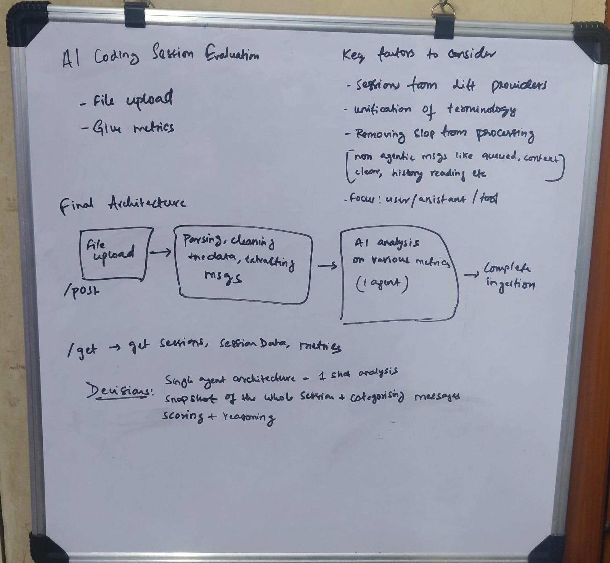
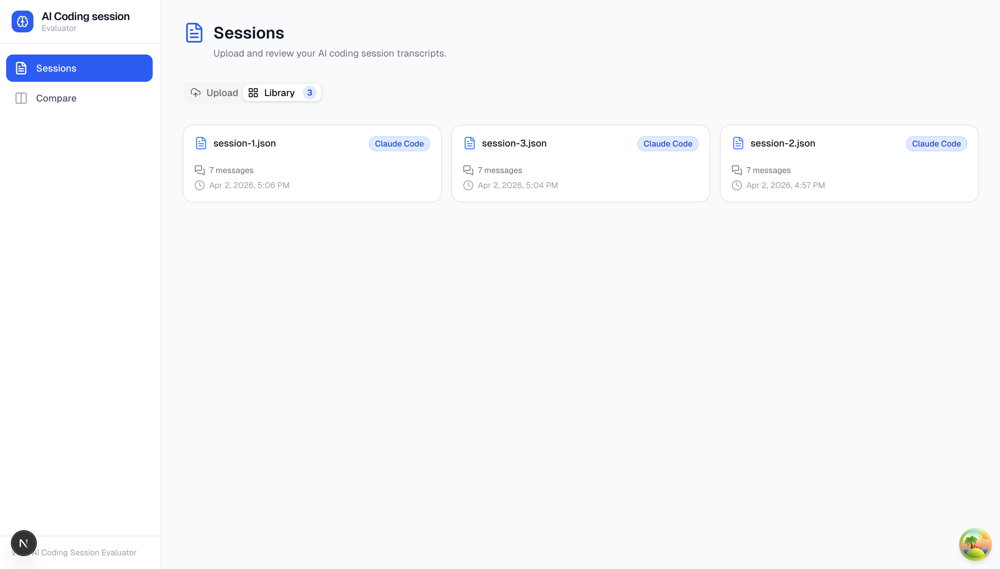
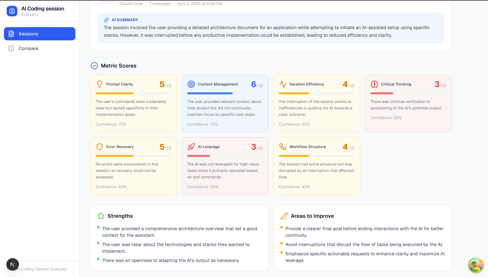
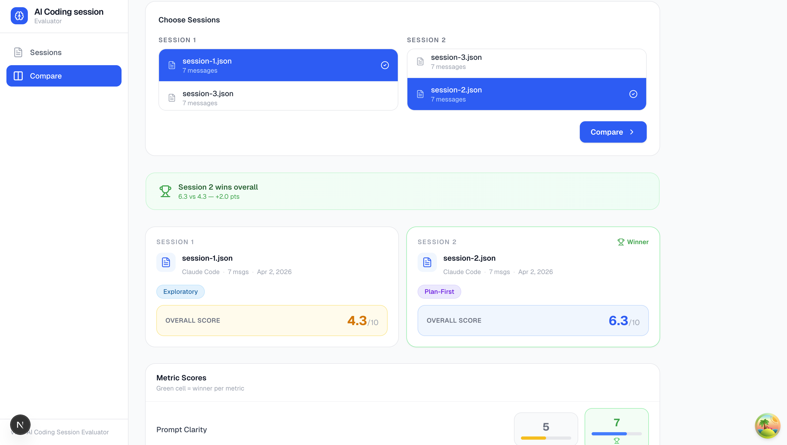

# AI Coding Session Evaluator

A tool for uploading and analysing AI coding session transcripts. Upload a session, get a breakdown of how you actually worked — where you spent time, how well you used context, whether you were iterating effectively, and where things fell apart.

---

## The Problem

When you finish a coding session with an AI assistant, you usually have no idea whether you used it well or not. Did you prompt clearly? Did you lose context halfway through? Were you just accepting whatever the AI gave you without thinking?

This tool takes your session transcript, runs it through a structured analysis pipeline, and scores it across 7 workflow dimensions — so you can actually see what's working and what isn't.

---

## Setup

### Prerequisites

- [Bun](https://bun.sh) (backend runtime)
- [Node.js](https://nodejs.org) 18+ (frontend)
- A Neon PostgreSQL database
- At least one of: OpenAI API key, OpenRouter API key

### 1. Clone and install

```bash
git clone <repo>
cd agent-session

# Backend
cd backend && bun install

# Frontend
cd ../frontend && npm install
```

### 2. Environment variables

**Backend** — create `backend/.env`:

```env
PORT=8000
DATABASE_URL=your_neon_connection_string
OPENAI_API_KEY=sk-...
OPENROUTER_API_KEY=sk-or-...   # optional fallback
```

**Frontend** — create `frontend/.env.local`:

```env
NEXT_PUBLIC_API_URL=http://localhost:8000/api
```

### 3. Run database migrations

```bash
cd backend
bun run src/db/migrate.ts
```

### 4. Start the servers

```bash
# Backend (in one terminal)
cd backend && bun run index.ts

# Frontend (in another terminal)
cd frontend && npm run dev
```

Frontend runs on [http://localhost:3000](http://localhost:3000), backend on port 8000.

---

## Overview



## Screenshots





## Demo

[Watch the walkthrough on Loom](https://www.loom.com/share/5c48da691aa24258a1af1baa8001525c)

- **Upload transcripts** from Claude Code, OpenAI Codex, or generic markdown-style sessions. The parser auto-detects the format.

- **Automatic analysis** runs right after upload — the session is scored across 7 metrics: Prompt Clarity, Context Management, Iteration Efficiency, Critical Thinking, Error Recovery, AI Leverage, and Workflow Structure.

- **Session detail view** shows per-metric scores with rationale, a workflow pattern label (plan-first, iterative, reactive, etc.), and a breakdown of strengths and areas to improve.

- **Segment timeline** splits the session into phases (planning, debugging, implementation, etc.) with per-segment scores so you can see exactly where things shifted.

- **Compare two sessions** side by side — pick any two sessions and see a metric-by-metric breakdown with a winner highlighted per metric and an overall winner banner.

- **Multi-provider AI fallback** — the analysis pipeline tries OpenAI first, falls back to OpenRouter if that fails, so you're not blocked by a single provider being down.

- **Structured output with Zod** — both frontend and backend use Zod schemas end-to-end, so the AI output is validated before it ever hits the database or the UI.
